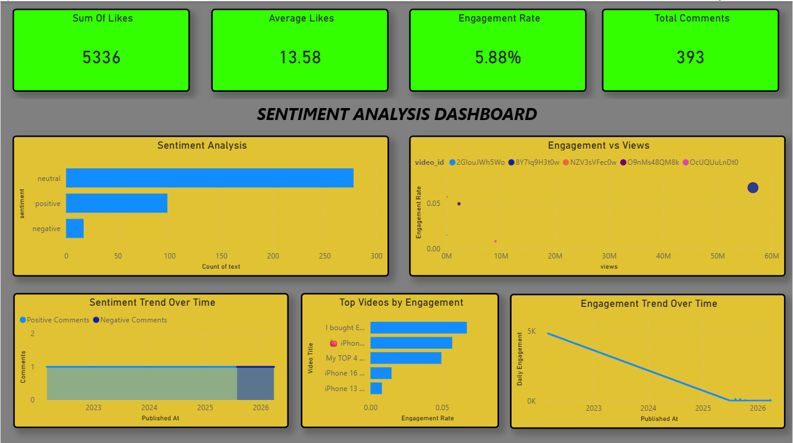

#  YouTube Content Intelligence & Engagement Analytics System

##  Project Overview

This project is an end-to-end **keyword-driven data analytics pipeline** that discovers YouTube videos based on a given topic, extracts both video-level and comment-level data, performs sentiment analysis, and generates actionable insights through an interactive Power BI dashboard.

Unlike traditional sentiment analysis projects, this system combines **content discovery, engagement analytics, and audience sentiment** to help understand what type of content performs best and how audiences respond over time.

---

## Problem Statement

Content creators and businesses often rely on surface-level metrics such as views and likes, which fail to capture true audience sentiment and engagement quality. Manually analyzing thousands of YouTube comments is time-consuming, inconsistent, and not scalable.

Additionally, there is not a simple automated system that converts raw YouTube data into actionable insights such as:

* Audience sentiment trends
* Engagement efficiency
* Content performance across topics

---

##  Solution

This project introduces a **keyword-based analytics pipeline** that:

1. Discovers videos dynamically using search keywords
2. Extracts video-level metrics (views, likes, total comments)
3. Fetches and processes comment-level data
4. Performs sentiment analysis using NLP
5. Computes engagement and performance metrics
6. Stores data in PostgreSQL using UPSERT logic
7. Visualizes insights in Power BI dashboard

---

##  Tech Stack

* **Python** – ETL pipeline development
* **Pandas** – Data transformation & aggregation
* **TextBlob** – Sentiment analysis
* **PostgreSQL** – Database with UPSERT operations
* **Power BI** – Dashboard visualization
* **YouTube Data API v3** – Data extraction

---

##  Pipeline Flow

```
Keyword Input → YouTube API → Python (ETL + NLP) → PostgreSQL → Power BI Dashboard
```

---

## Key Features

* 🔍 Keyword-based video discovery
* 📊 Video-level + Comment-level analytics
* 💬 Sentiment classification (Positive / Neutral / Negative)
* ⚡ Engagement metrics calculation
* 🔁 PostgreSQL UPSERT for efficient updates
* 📈 Interactive Power BI dashboard
* 🧩 Modular and scalable pipeline

---

##  KPIs & Metrics

* **Total Comments** – Total number of comments across selected videos
* **Total Likes** – Sum of likes on all comments
* **Average Likes** – Average likes per comment
* **Engagement Rate** – (Total Likes + Total Comments) / Total Views

---

##  Dashboard Visuals

* **Sentiment Analysis (Bar Chart)**
  Displays count of positive, neutral, and negative comments

*  **Engagement vs Views (Scatter Plot)**
  Compares video views with engagement rate to identify high-performing content

*  **Sentiment Trend Over Time (Line Chart)**
  Tracks how positive and negative sentiments change over time

*  **Top Videos by Engagement (Bar Chart)**
  Highlights videos with highest engagement rate

*  **Engagement Trend Over Time (Line Chart)**
  Shows how overall engagement changes over time

---

## Business Use Cases

* Identify high-performing content strategies
* Track audience sentiment trends
* Detect negative feedback early
* Optimize content using engagement insights
* Understand audience behavior

---

##  Automation

The pipeline can be automated using:

* Windows Task Scheduler
* Cron Jobs

This ensures periodic updates and real-time insights.

---

##  Challenges & Solutions

* API Rate Limits → Implemented request throttling
* Noisy Text Data → Applied preprocessing techniques
* Duplicate Records → Solved using UPSERT
* Schema Changes → Handled with table redesign

---

##  Learning Outcomes

* Built an end-to-end ETL pipeline
* Integrated API, database, and dashboard
* Applied NLP for sentiment analysis
* Created business-driven insights
* Designed scalable data workflows

---

## Project Structure

```
YouTube_Engagement_Analysis/
│
├─ dataset/
│   ├─ comments_raw.csv
│   └─ comments_cleaned.csv
│
├─ scripts/
│   ├─ fetch_comments.py
│   ├─ clean_data.py
│   ├─ analyze_data.py
│   └─ db_operations.py
│
├─ reports/
│   └─ engagement_dashboard.png
│
├
│   
│
├─ README.md
├─ requirements.txt
└─ main.py
```

---

##  Dashboard Preview

<p align="center">
  
</p>

---

## Future Improvements

* Real-time comment streaming
* Advanced NLP (topic modeling, emotion detection)
* Multi-keyword comparison
* Power BI Service deployment
* Integration with other platforms

---

##  Key Highlight

> This project goes beyond basic sentiment analysis by combining keyword-based content discovery, engagement analytics, and audience sentiment.

---

##  Conclusion

This system transforms raw YouTube data into actionable insights by bridging the gap between content performance and audience perception.
