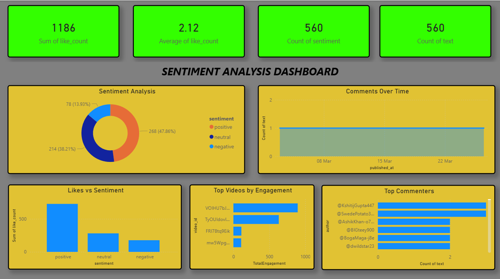

# YouTube Engagement Analysis Pipeline

## Project Overview

This project is an end-to-end automated pipeline that fetches comments from YouTube videos, performs data cleaning and sentiment analysis, computes engagement metrics, stores the data in PostgreSQL, and visualizes insights using Power BI. The pipeline enables businesses to monitor audience engagement, sentiment trends, and content performance efficiently.

## Problem Statement

Businesses and content creators often struggle to understand audience sentiment and engagement across YouTube videos. Manual analysis is time-consuming, inconsistent, and does not provide actionable insights. Key challenges include:

* Collecting and consolidating comments across multiple videos.
* Analyzing sentiment and engagement metrics efficiently.
* Generating visual dashboards for decision-making.

## Solution

This project provides an automated and scalable solution to track engagement and sentiment on YouTube:

1. **Data Collection:** Fetch comments from multiple videos using the YouTube Data API v3.
2. **Data Cleaning & Processing:** Remove duplicates, handle missing values, and compute sentiment scores using NLP techniques.
3. **Database Storage:** Store cleaned comments in PostgreSQL with UPSERT logic to maintain updated records.
4. **Analytics:** Compute KPIs such as total comments, total likes, average likes per comment, sentiment distribution, top videos, and top commenters.
5. **Visualization:** Build interactive dashboards in Power BI for actionable insights.

## Tech Stack

* Python: Data extraction, cleaning, and sentiment analysis
* Pandas: Data manipulation and aggregation
* TextBlob: Sentiment analysis
* PostgreSQL: Database storage with UPSERT support
* Power BI: Dashboard visualization and reporting
* YouTube Data API v3: Fetch video comments

## Pipeline Flow

```
YouTube API → Python (Fetch & Clean) → PostgreSQL → Power BI Dashboard
```

Steps:

1. **Fetch Comments:** Query YouTube API for videos matching a keyword.
2. **Clean Data:** Remove duplicates, clean text, compute sentiment, and standardize date formats.
3. **Analyze Engagement:** Compute total comments, likes, average likes, sentiment counts, top commenters, and top videos.
4. **Database Storage:** Create a table in PostgreSQL if not exists, and UPSERT cleaned and analyzed comments.
5. **Visualization:** Build interactive Power BI dashboard to track engagement trends.

## Features

* Automated comment scraping from YouTube videos.
* Data cleaning and sentiment analysis using Python.
* Calculation of engagement metrics.
* PostgreSQL storage with UPSERT to handle duplicate entries.
* Interactive Power BI dashboard for insights and trends.
* Modular Python scripts for scalability and reusability.

## KPIs & Insights

* **Total Comments:** Overall volume of engagement per video.
* **Total Likes:** Sum of likes on comments.
* **Average Likes per Comment:** Measure of comment impact.
* **Sentiment Distribution:** Proportion of positive, negative, and neutral comments.
* **Top Commenters:** Most active users in discussions.

## Dashboard Visuals

* **Sentiment Distribution:** Pie or doughnut chart showing positive, neutral, and negative comments.
* **Comments Over Time:** Line chart showing comments per day/week/month.
* **Likes vs Sentiment:** Column chart displaying likes per sentiment category.
* **Top Videos by Engagement:** Bar chart combining comment count and likes per video.
* **Top Commenters:** Horizontal bar chart showing most active users.


## Automation

The Python scripts are modular and can be scheduled using Windows Task Scheduler or cron jobs to fetch and analyze new comments automatically. This ensures dashboards are updated periodically without manual intervention.

## Learning Outcomes

* Build end-to-end ETL pipelines for unstructured data.
* Fetch and manage data from APIs with rate limiting.
* Perform data cleaning, preprocessing, and sentiment analysis.
* Manage PostgreSQL operations with UPSERT logic.
* Create interactive dashboards using Power BI for business insights.
* Understand audience behavior and engagement metrics for decision-making.

## Project Structure

```
YouTube_Engagement_Analysis/
│
├─ dataset/                 
│   ├─ comments_raw.csv
│   └─ comments_cleaned.csv
│
├─ scripts/                  
│   ├─ fetch_comments.py
│   ├─ clean_data.py
│   ├─ analyze_data.py
│   └─ db_operations.py
│
├─ reports/                  
│   └─ engagement_dashboard.png
│
├─ utils/                    
│   └─ sentiment_analysis.py
│
├─ README.md
├─ requirements.txt
└─ main.py                   
```

## Dashboard Preview

<p align="center">
  
</p>

## Next Steps / Improvements

* Add real-time streaming for new comments.
* Implement advanced NLP techniques such as topic modeling.
* Expand visualization to compare multiple keywords or channels.
* Integrate Power BI Service or Google Data Studio for live dashboards.

```
```
